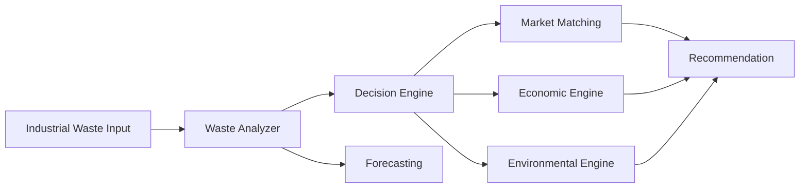

# WASTEWISE AI

## Problem
Industrial waste streams are heterogeneous and decision-making is more than waste classification. Factories need to know what each waste should become, where it can go, and whether the outcome creates value while reducing environmental burden.

## Solution
WASTEWISE AI is an industrial decision-support platform that combines waste characteristics, pathway evaluation, market matching, economic analysis, environmental estimates, and forecasting to recommend the most valuable valorization pathway.

## Innovation
The product frames the problem as a decision engine rather than a classifier: waste inputs are translated into actionable opportunity pathways with transparent explanations and prototype market compatibility scoring.

## Features
- Premium industrial AI dashboard
- Explainable analysis flow
- Dynamic what-if simulator
- Pathway comparison intelligence
- Prototype market matching
- Forecasting with historical trend view
- Demo-safe fallback mode

## Architecture


## Technology stack
- Frontend: React + Vite + JavaScript
- UI: CSS, Lucide icons, Recharts, Framer Motion
- Backend: FastAPI + Pydantic + SQLAlchemy
- Database: SQLite
- ML: scikit-learn + joblib + pandas + numpy

## AI approach
The system separates:
1. Rule-based weighted decision intelligence
2. Machine learning forecast for historical waste trends
3. Prototype explanation layer for decision reasons

## Decision engine
The pathway scoring model includes material compatibility, contamination, market demand, quantity fit, logistics, economic feasibility, and environmental benefit. All scores are normalized transparently and exposed in the API.

## Forecasting
The forecasting engine reads historical waste data, aggregates monthly totals, trains a simple Linear Regression model, and predicts the next month of waste generation. It is intentionally easy to replace with a more advanced model later.

## Market matching
The market module ranks available prototype industrial users according to material match, quantity fit, demand, distance, and processing requirements. These are clearly labeled as prototype market users, not real company data.

## Economic analysis
The economic engine calculates revenue, processing cost, transport cost, avoided disposal cost, and net value using a transparent formula.

Net Value = Revenue - Processing Cost - Transport Cost + Avoided Disposal Cost

## Environmental analysis
The environmental engine calculates waste diverted and supports configurable factors for future verification. It explicitly marks values as demo estimates and avoids claiming scientific validation.

## What-if simulator
The what-if flow reuses the same scoring engine as the main analysis to test contamination, market demand, transport distance, quantity, processing cost, and transport cost. The recommendation adapts dynamically in response to scenario changes.

## Installation

### Frontend
```bash
npm install
npm run dev
```

### Backend
```bash
python3.12 -m venv .venv
.venv\Scripts\Activate.ps1
python -m pip install -r backend/requirements.txt
$env:PYTHONPATH = "backend"
python -m uvicorn app.main:app --reload --app-dir backend
```

In PowerShell, use `Set-Location "D:\PD\WASTEWISE-V2"` to change to the project directory. The Unix-style `cd /d/PD/WASTEWISE-V2` form resolves incorrectly in PowerShell.

### Backend tests
```powershell
Set-Location "D:\PD\WASTEWISE-V2"
$env:PYTHONPATH = "backend"
python3.12 -m pytest backend/tests -q
```

### API docs
- Backend: http://localhost:8000
- Swagger UI: http://localhost:8000/docs
- Frontend: http://localhost:5173

## Demo flow
1. Open the dashboard.
2. Explain the industrial waste valorization problem.
3. Go to Analyze Waste.
4. Enter Foundry Sand with a weekly quantity of 2.5 tonnes.
5. Run the analysis and show the pipeline animation.
6. Explain the 91/100 recommendation.
7. Compare pathway scores.
8. Increase contamination in What-If and show the recommendation shift.
9. Review prototype market users.
10. Explain future planning using the forecast view.

## Project structure
```text
WASTEWISE-V2/
├── backend/
│   ├── app/
│   ├── tests/
│   ├── requirements.txt
│   ├── seed.py
│   └── pytest.ini
├── data/
├── docs/
├── src/
├── .env.example
├── .gitignore
├── index.html
├── package.json
├── README.md
├── vite.config.js
└── public/
```

## Limitations
- Values are prototype estimates rather than validated market data.
- Environmental factors are demo estimates.
- Forecasting is a simple explainable model for a hackathon demo.

## Future improvements
- Real industrial datasets
- More advanced ML models with explainability
- Procurement and logistics integrations
- Carbon accounting validation and digital twin integration

## Team contribution
This project is designed as a hackathon-ready prototype combining product, frontend, backend, and decision-engine work for industrial waste valorization.
