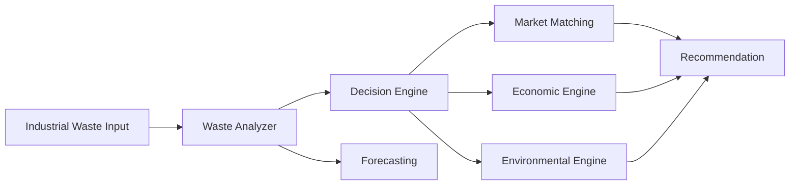

# WASTEWISE AI Architecture

WASTEWISE AI is a decision-support platform for industrial waste valorization. The frontend presents a polished dashboard and analysis flow while the backend contains the decision engine, market matching, economics, environmental estimation, and forecasting capability.

## Layers

- Frontend: React + Vite + Recharts
- Backend: FastAPI + Pydantic + SQLAlchemy
- Data: SQLite + CSV-backed historical data
- Intelligence: explainable scoring engine + ML forecast

## Design principles

- Explainable decisions
- Demo-safe prototype values
- Clear limitation flags
- Modular services

## Core decision flow

1. Validate the waste profile.
2. Normalize the input composition and contamination.
3. Score pathways with weighted factors.
4. Match potential industrial users.
5. Estimate economic value and environmental impact.
6. Return a recommendation with justifications.
